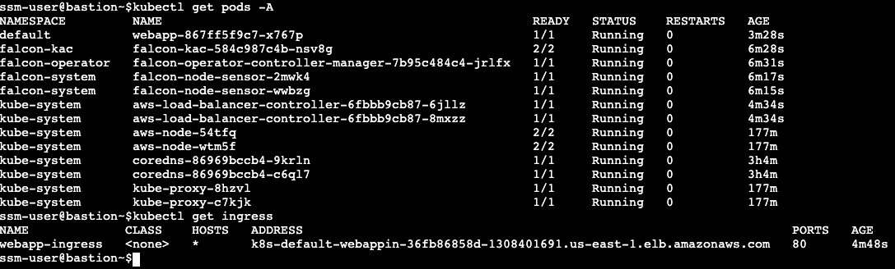
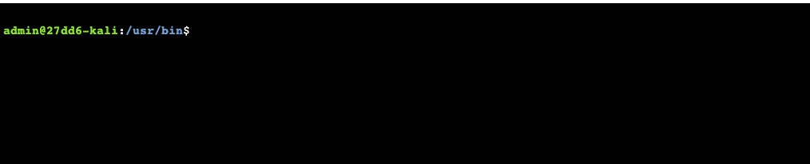

# Lab 0: Connect to the Kali Linux instance

Throughout the lab, you will interact with the AWS Management Console, the AWS CLI, Kubernetes CLI, and the CrowdStrike Falcon Platform. You will run AWS CLI commands on the Attacker instance (Kali) and on a Bastion host instance (LinuxBastion). A CLI shell will be provided by AWS Systems Manager (SSM) Session Manager connection which you can access from the Amazon Elastic Compute Cloud (EC2) Console. SSM Session Manager connections do not require open ports or SSH keys, which improves your security posture. Access is controlled by AWS Identity and Access Management (IAM) and audited by AWS CloudTrail.

1. **Access Bastion host**

   1. Connect to the Bastion EC2 instance: [Bastion EC2 Instance](https://us-east-1.console.aws.amazon.com/ec2/home?region=us-east-1#Instances:tag:Name=LinuxBastion)
   1. Select the checkbox next to LinuxBastion
   1. Click “Connect” on the top navigation bar, and then click the orange “Connect” button on the Session Manager tab.
   1. You are connected to the Bastion instance!
   1. Execute below command to view all the pods running
      ```
      kubectl get pods -A
      ```
      

2. **Access Kali Instance**

   Kali Linux is an open-source, Debian-based Linux distribution aimed at advanced Penetration Testing and Security Auditing by providing common tools, configurations, and automations.

   1. Connect to the Kali EC2 instance: [Kali EC2 Instance](https://us-east-1.console.aws.amazon.com/ec2/home?region=us-east-1#Instances:tag:Name=Kali)
   1. Select the checkbox next to “Kali”
   1. Click “Connect” on the top navigation bar, and then click the orange “Connect” button on the Session Manager tab.
   1. You are connected to the Kali instance!

   
