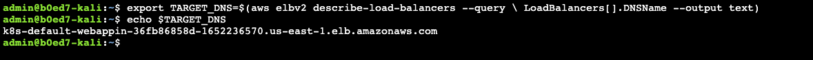
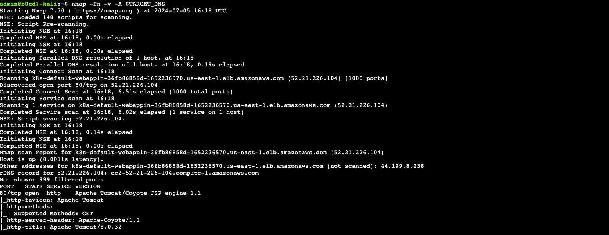
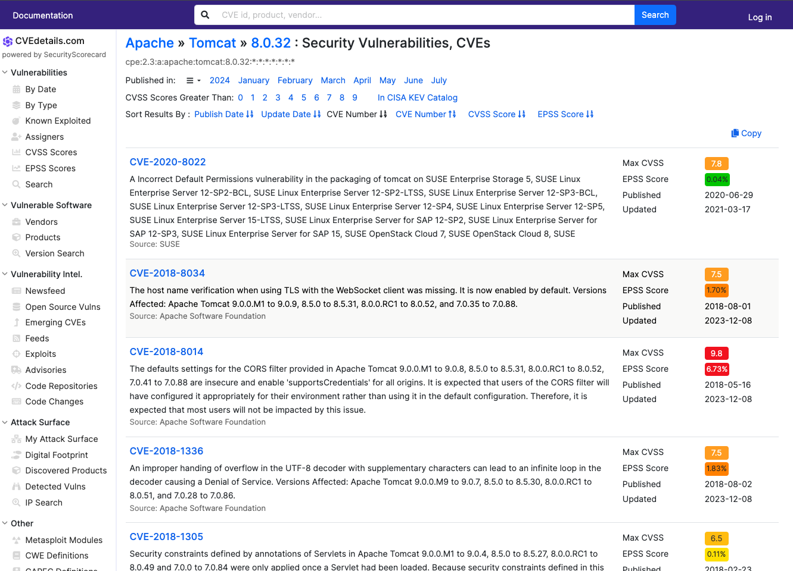
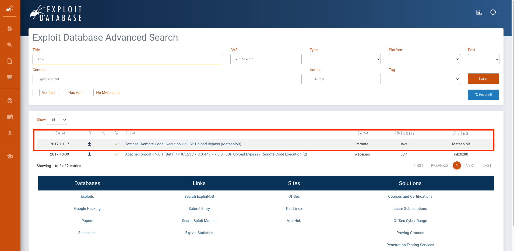
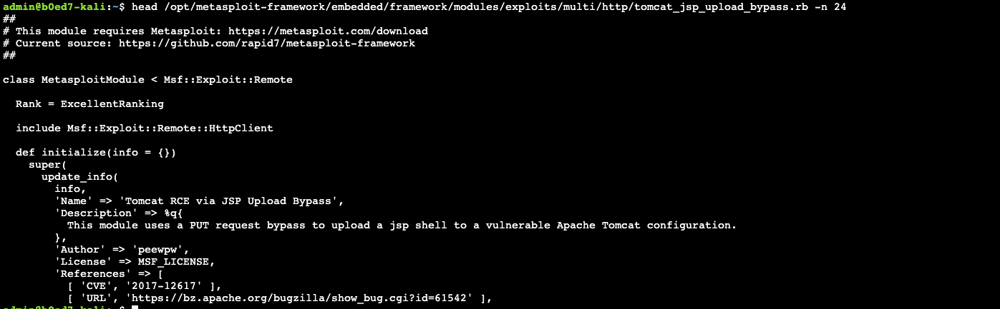

# Lab 1: Enumerating the Target

All malicious attacks occur in phases, beginning with an initial reconnaissance phase in which a potential target is identified, followed by an enumeration phase to gather more information about the target. The reconnaissance phase often begins as an automated, systematic network scan over millions of IP addresses to locate open ports.

In our scenario, we locate a web server listening on port 80, and begin the attack from there.

Instead of scanning millions of addresses, we’ll save some time and start with the DNS name of the AWS Application Load Balancer (ALB) which distributes traffic to our vulnerable Tomcat service running on an EKS cluster

> [!NOTE]
> Run the attack sequence commands in the next few lab sections on your Kali shell.

**1. Identify the target**

Write the ALB DNS name to a variable using the AWS CLI on your Kali session.

```shell
export TARGET_DNS=$(aws elbv2 describe-load-balancers --query \ LoadBalancers[].DNSName --output text)
echo $TARGET_DNS
```

> [!TIP]
> You could also find the DNS name in the AWS management console. Application Load Balancers are managed in the Amazon EC2 console - https://us-east-1.console.aws.amazon.com/ec2/home?region=us-east-1#LoadBalancers:sort=loadBalancerName



**2. Scan for available services**

Now that we’ve identified our target, we need to scan it for vulnerable services that we can attack. To do so, we will need to make use of the utility _nmap_.

Nmap is a free and open-source network scanner created by Gordon Lyon. Nmap is used to discover hosts and services on a computer network by sending packets and analyzing the responses. Read more at: https://nmap.org/

Use nmap to perform a scan of our target

```shell
nmap -Pn -v -A $TARGET_DNS
```

We’re using nmap scan options to perform a relatively quick scan of all the ports on the system by specifying the following commands:

```
-Pn Skip the ping check

-A Enable OS detection

-v Increase verbosity
```

In the resulting output you will find the following. Your results will vary:

1. The target is an AWS elb (Elastic Load Balancer)
1. The IP address is 52.21.226.104
1. The reverse DNS entry for the A record (**k8s-default-webappin-36fb86858d-1652236570.us-east-1.elb.amazonaws.com**)
1. The number of ports scanned (1,000 scanned) and the number of ports that did not connect (999 filtered)
1. The alternate public ip address (2nd Availability Zone) is 44.199.8.238
1. A listing of available service ports (port **80/tcp** only)
   - The state of this port (open)
   - The service type (http)
   - The application version running on this port (**Apache Tomcat/Coyote JSP engine 1.1**)
   - Since this was a web service port, a few additional checks were performed:
     - Default favicon was downloaded if present
     - Additional HTTP headers provided us with the Apache Tomcat version (**Apache Tomcat/8.0.32**)



With this detail, we are now ready to begin the investigation of the only service that shows available, the HTTP service (TCP port 80).

**3. Identifying a viable exploit**

Based on the naming convention of the DNS entry, we can surmise that our target is an Amazon Web Services (AWS) Elastic Load Balancer (ELB) and most likely an Application Load Balancer (ALB). This load balancer is the front-end for a web server application and the HTTP header results readily provide the application name Apache Tomcat and version 8.0.32.

Now that we’ve identified the running application and version, let’s see if we can identify an available exploit to leverage against this endpoint. To do so, we will make use of two websites containing exploit information.

Check CVEdetails.com for vulnerabilities associated with Apache Tomcat v8.0.32: https://www.cvedetails.com/vulnerability-list/vendor_id-45/product_id-887/version_id-554739/Apache-Tomcat-8.0.32.html



Browse through the known vulnerabilities. Locate `CVE-2017-12617` and note that it is both "known exploited" and has a "public exploit." Since we know this CVE has a public exploit, search for the CVE number on Exploit-DB for additional information on how to launch an attack.

https://www.exploit-db.com/search?cve=2017-12617



Open the link in the Exploit-DB results for the JSP Upload Bypass (Metasploit) attack.

https://www.exploit-db.com/exploits/43008

The output is the first few lines of an attack script that you will use with the Metasploit Framework tool already deployed on Kali. In fact, the contributors to Kali simplify the process by preloading a long list of exploit scripts. When we launch the attack in the next section, we’ll already have what we need.

4. View the module on Kali

```
head /opt/metasploit-framework/embedded/framework/modules/exploits/multi/http/tomcat_jsp_upload_bypass.rb -n 24
```



> [!NOTE]
> The exploit is documented in Github with detailed instructions on how to use it https://github.com/rapid7/metasploit-framework/blob/master/documentation/modules/exploit/multi/http/tomcat_jsp_upload_bypass.md

We have now completed the first phases of the attack. We have identified a target application with a potential vulnerability that we can exploit to gain access to the hosted environment and the required tools to perform the attack.

> [!TIP]
> For more detail regarding this vulnerability and relevant scenarios for mitigating negative impacts, review the security advisory: https://nvd.nist.gov/vuln/detail/CVE-2017-12617
