# Lab 5: Protecting Cluster and Cloud with CrowdStrike

In this section, we’ll see how CrowdStrike responds to an attack on our vulnerable containerized Tomcat application on an EKS cluster. As you’ll see, CrowdStrike will detect and stop the attack early and immediately, with minimal post-install effort.

Crowdstrike Falcon Cloud Security Cloud Workload Protection provides multiple layers of protection for EKS Cluster security components:

**Falcon Node Sensor:** provides kernel mode visibility into your workloads with the ability to block attacks automatically while also monitoring for Indicators of Attack (IOAs) and other behavioral anomalies.

**Falcon Kubernetes Admission Controller:** provides visibility into the cluster by collecting event information from the Kubernetes management plane. These events are correlated to sensor events and cloud events to provide complete cluster visibility. The KAC also includes a policy engine which enables customers to log, alert, or block deployment of vulnerable or misconfigured containers.

**Falcon Console Detections**

Open the Falcon Console to view detections related to our malicious activity at:

https://falcon.crowdstrike.com/activity-v2/detections

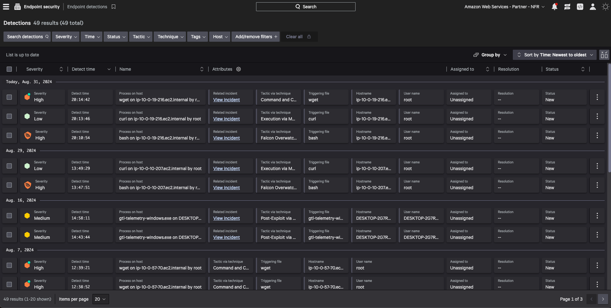

Click on the “wget” detection for quick details

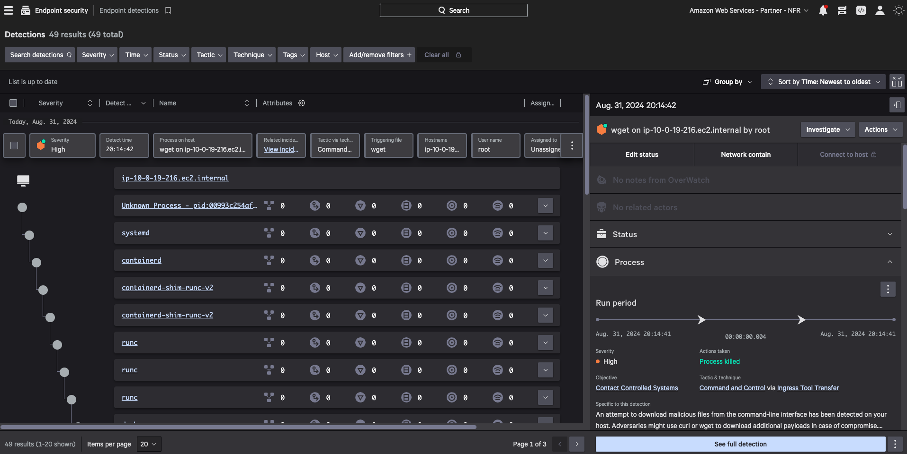

We can see that the wget process was killed before it was able to download additional malware. In the event that the sensor was unable to identify the download as malware, runtime protection would kill the process instantly upon execution if it exhibited suspicious behavior, such as drive encryption indicative of a ransomware attack.

Additional forensic information expands from the right side. This expanded section provides the ability to interact with the detection. For example, you can set the status of the detection, view the execution details, host information, and other artifacts associated with this detection.

_Click on “See full detection” for extended details and pivots to other platform components._

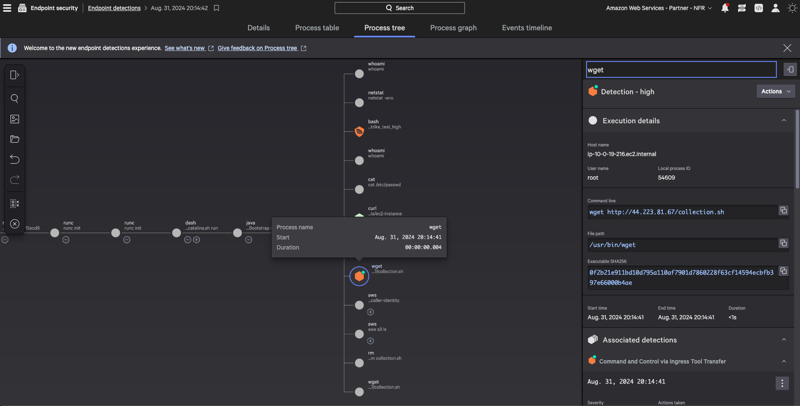

This brings you to the “Process Tree” view for a quick visualization of the process tree showing process-level events leading to the spawning of attack-related processes. The Event Timeline view provides a more detailed, tabular view of the process details.

Click on “Details” for multiple layers of contextual insight related to the detection. Each section enables further investigation, detail pages and graphic visualizations.

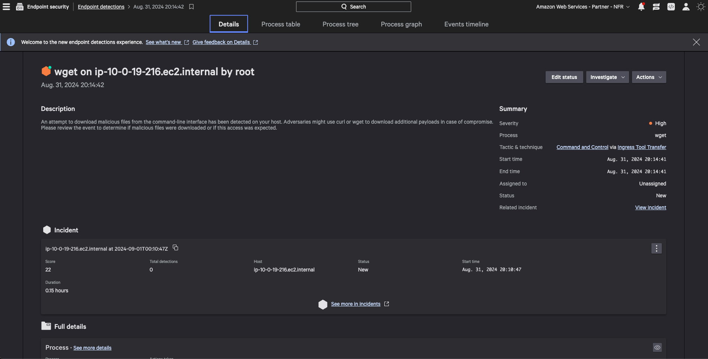

It looks like the first malicious process executed is the DASH process, since it's the leftmost process with orange coloring.

Click on the DASH process.

The sidebar on the right will show the details of the process. It seems like this process was detected for performing malicious activity which matches up with what we just did in the previous scenario. When we ran Metasploit and gained initial access, Falcon was able to detect that behavior and identify it as malicious.

We can see the adversary's objective as well as the MITRE Tactic and Technique. It had gained Initial Access via a public-facing application, which in this case was Tomcat.

Falcon also provides the Indicator of Attack (IOA) name and description to help you understand what's happening in this situation. Notice that we get full visibility of the cli commands run during the attack including some AWS cli commands where the attacker was accessing an S3 bucket.

We just examined the Medium severity detection which provided deep visibility into the attack. We can use that to investigate further to understand the depth and breadth of the impact, and also as a guide on how to remediate related misconfigurations.

Let’s take a brief look at the High severity detection. If we drill down into the process tree, we see our last two wget commands where we attempted to download malware tools. Falcon blocked those from downloading and killed the Kali Metasploit reverse shell.

**Indicators of Misconfiguration**

Scroll down on the side bar to Cloud misconfigurations

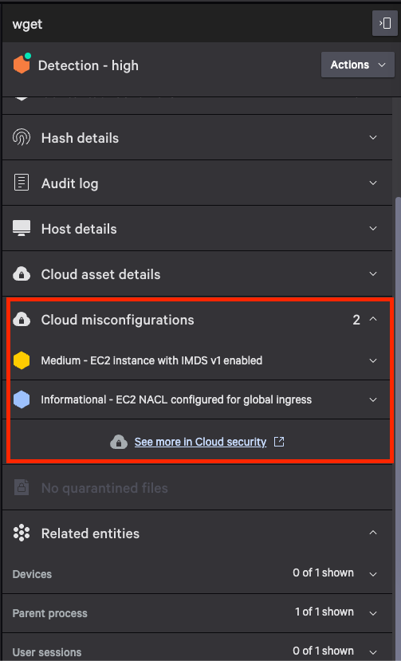

Click on **See more in Cloud security**

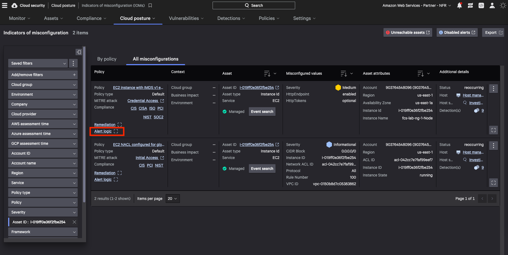

This reveals the most recent configuration assessment findings filtered to that specific policy. There are also menu options to view historical assessments or filter the results based on other attributes. Clicking on the results for a specific account and region will reveal the detailed findings.

Along with the detailed findings, this page includes links to important information like MITRE ATT&CK context and alert logic.

Click on Alert Logic to view the list of steps you can use to uncover this type of misconfiguration

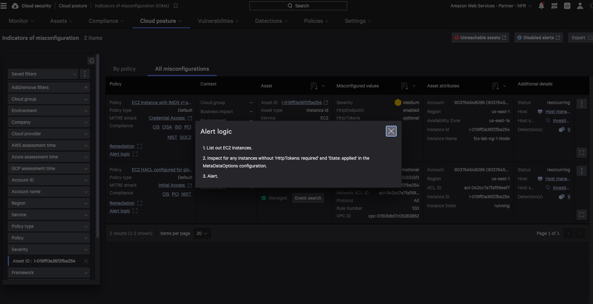

With the detailed information about the findings for this policy, we can look towards correcting these misconfigurations.

Click on the Remediation link to see the required steps

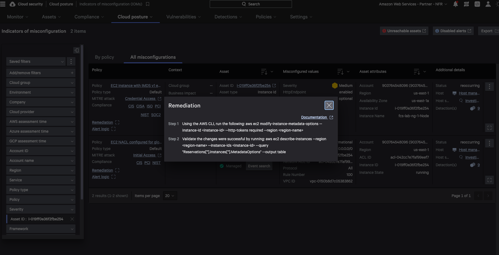

In this scenario, we reviewed the top misconfiguration findings on the dashboard and investigated those associated with a specific EC2 policy. We drilled down on those findings and learned how and where to remediate them in AWS.

**Indicators of Attack**

During our earlier attack, we applied the blank logging policy to disable s3 bucket access logging. In this section, we will check if the CrowdStrike Falcon Platform detected and reported on this activity.

In the Falcon Console, go to the Cloud security posture section at https://falcon.crowdstrike.com/cloud-security/cspm/dashboard

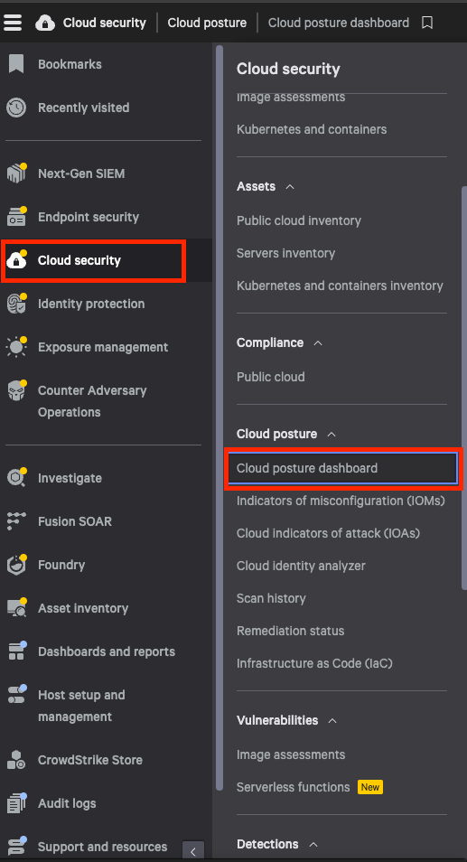

Go to Cloud posture > Cloud indicators of attack(IOAs). Filter by AWS Account ID and the service as S3

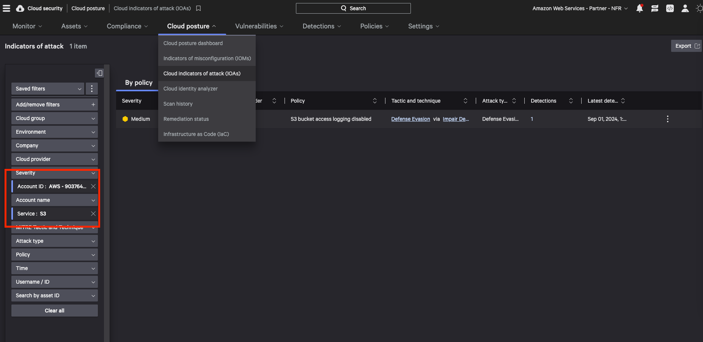

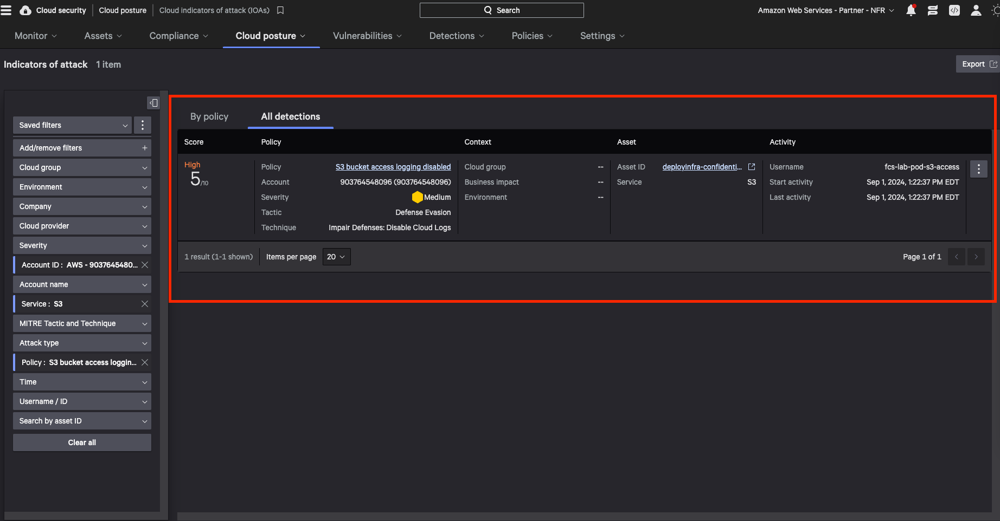

You can see the S3 bucket access logging disabled policy.

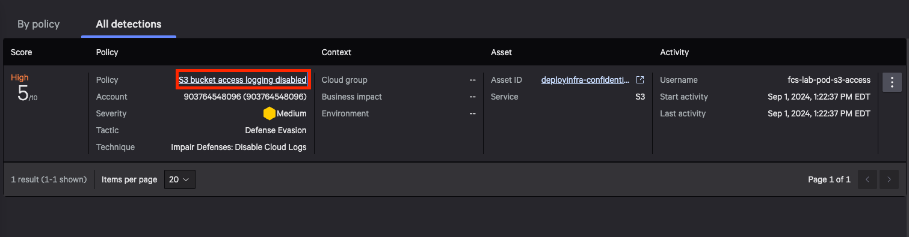

View the IOA associated with bucket logging. Click on the Policy,

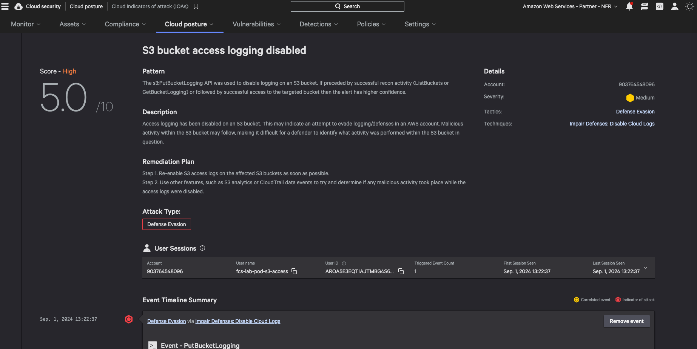

The CrowdStrike Falcon Cloud Security platform detects the suspicious activities generated through lateral movement.

**Extending detections with CrowdStrike Custom IOAs**

CrowdStrike uses the detailed event data collected by the Falcon agent to develop rules or indicators that identify and prevent fileless attacks that leverage bad behaviors. Over time, CrowdStrike tunes and expands those built in indicators to offer immediate protection against the latest attacks.

In addition to the included global IOAs, there is also an option to create custom rules in the Falcon Platform. This gives customers the ability to create behavioral detections based on what they know about their specific applications and environment.

Given that we know that our application exposes the risk of lateral movement if the container is breached we can create a custom IOA that will alert and block on any invocation of the AWS CLI.

_Investigate Process Activity_

Click on Investigate > Events

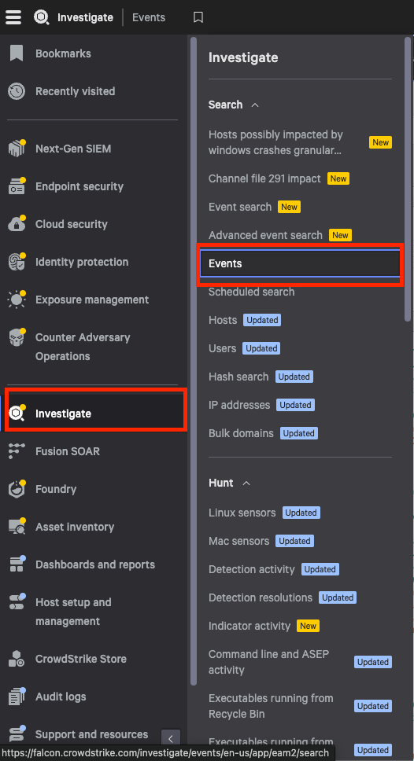

Enter the following search string

```
event_platform=Lin FileName="aws"
```

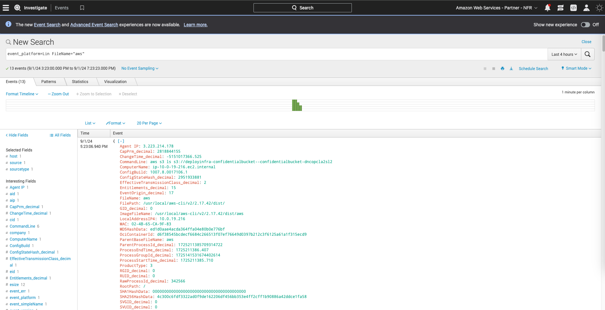

_Creating the Custom IOA Rule Group_

Using the drop-down menu (Menu icon, upper left-hand corner), select Endpoint Security > Configure > Custom IOA Rule Groups.

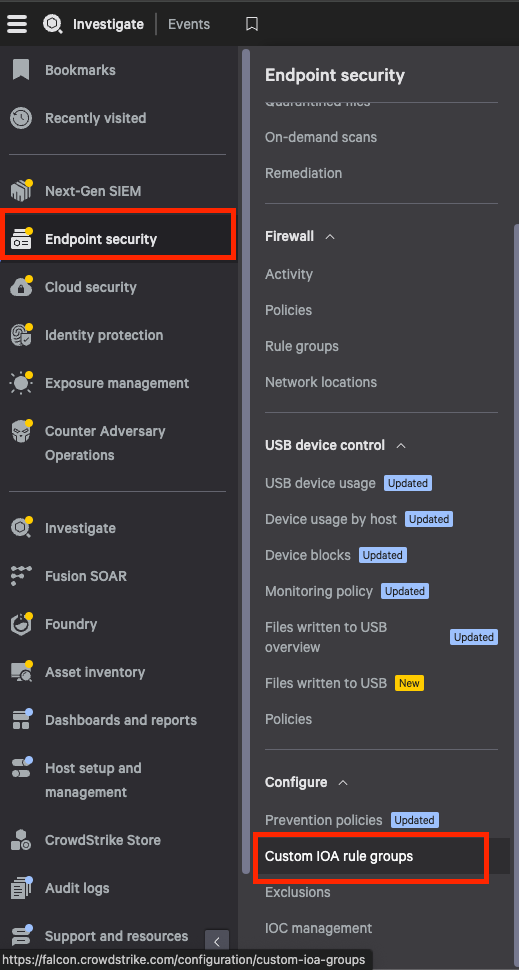

Click Create rule group

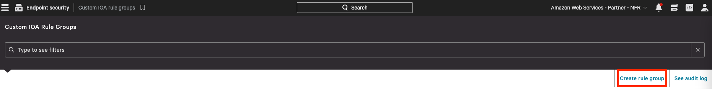

Enter a value for RULE GROUP NAME and select a PLATFORM from the drop-down

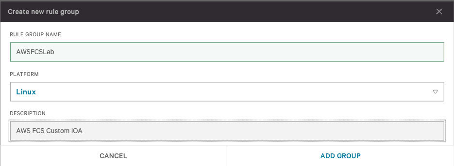

Click the ADD GROUP button.

Your new Custom IOA Rule Group is now added to your Falcon environment.

Click the Enable group link.

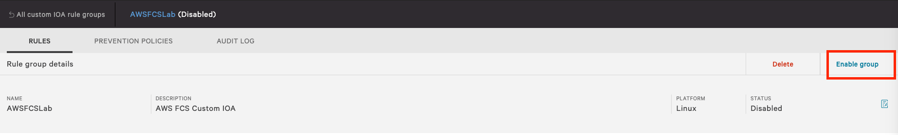

Then, at the ENABLE RULE GROUP dialog, click the ENABLE RULE GROUP button

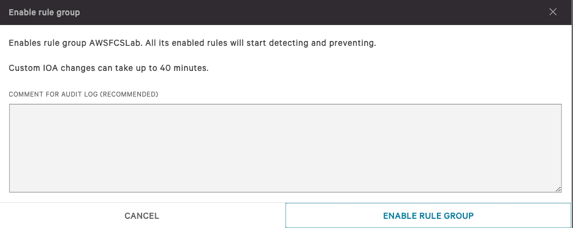

_Creating the rule to detect a lateral movement Indicator of Attack_

On the same page, we can create and enable the Custom IOA rule to block lateral movement to S3. In this case, we only want to prevent commands to AWS that are executed via dash (a lightweight Debian shell).

Click the Add New Rule button and create an IOA rule with the following values

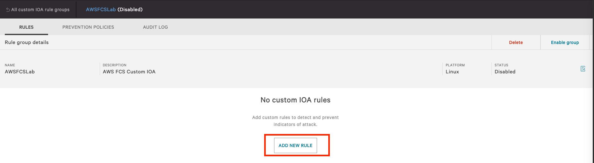

| Parameter                  | Value                   |
| -------------------------- | ----------------------- |
| RULE TYPE                  | Process Creation        |
| ACTION TO TAKE             | Kill Process            |
| SEVERITY                   | High                    |
| RULE NAME                  | AWSFCSRule              |
| RULE DESCRIPTION           | AWS FCS Lab Custom Rule |
| GRANDPARENT IMAGE FILENAME | `.*`                    |
| GRANDPARENT COMMAND LINE   | `.*`                    |
| PARENT IMAGE FILENAME      | `.*dash.*`              |
| PARENT COMMAND LINE        | `.*`                    |
| IMAGE FILENAME             | `.*aws.*`               |
| COMMAND LINE               | `.*aws\s+.*`            |

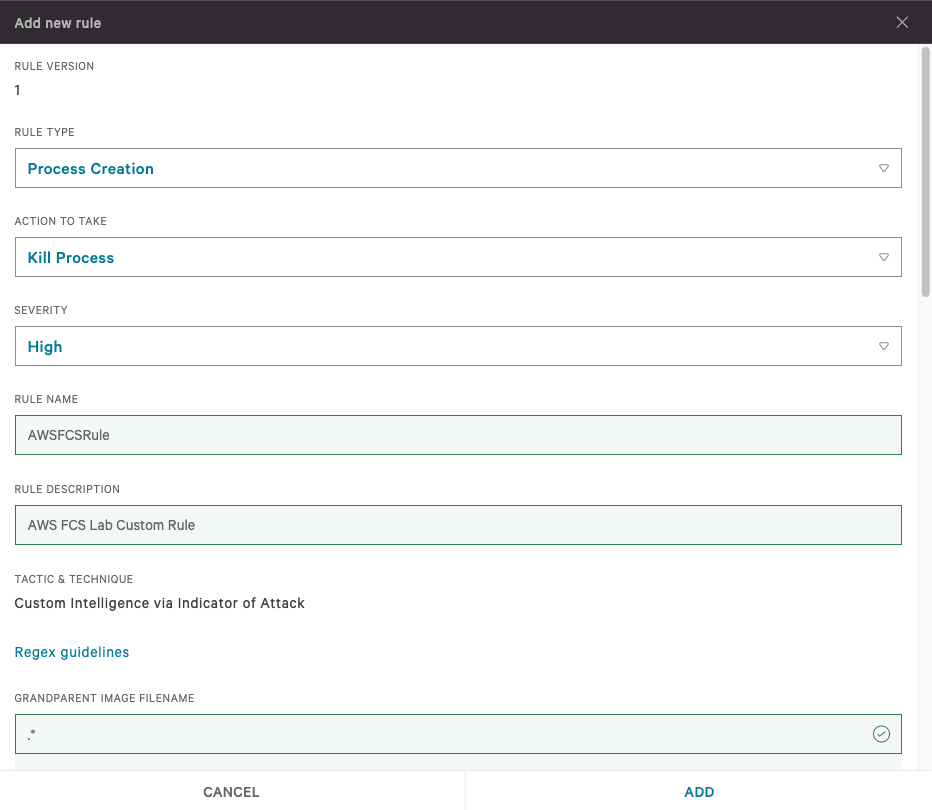

When you click ADD, the rule will be created in a disabled state.

Select the checkbox for this new rule, click the Enable button, followed by the Change Status dialog button

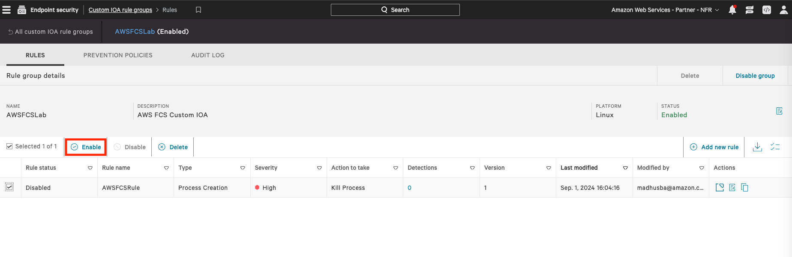

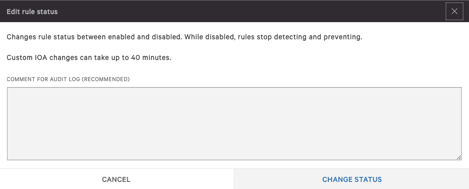

Our Custom IOA rules are now created and will take effect within 40 minutes.

_Assigning the Prevention Policy_

Finally, we need to assign this Custom IOA Rule Group to a prevention policy.

From the upper left-hand corner, select Endpoint security > Configure > Prevention Policies

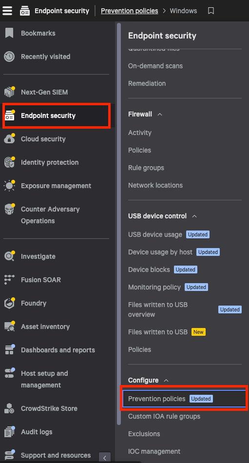

Policies are broken out by operating system. For our lab environment, we will select LINUX POLICIES. Click on Default(Linux) policy

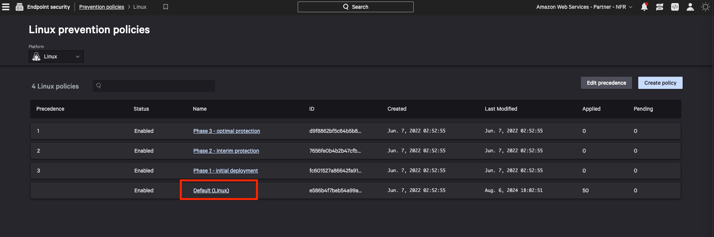

Select `Assigned custom IOAs` and click on `Assign rule group`

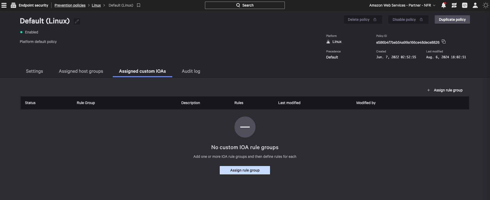

Select recently created rule group and click on `Assign group`

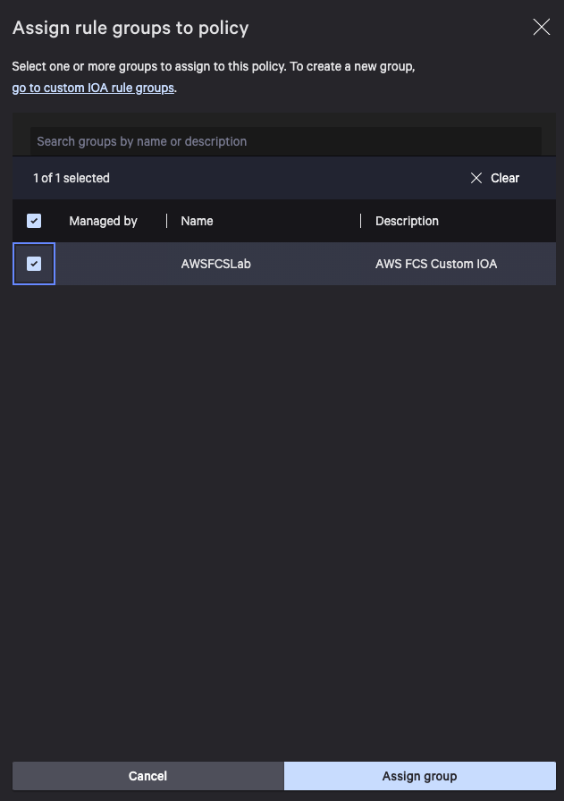

Your Custom IOA rule group should now be assigned to the policy. You can confirm this in the ASSIGNED CUSTOM IOAS section of the display.

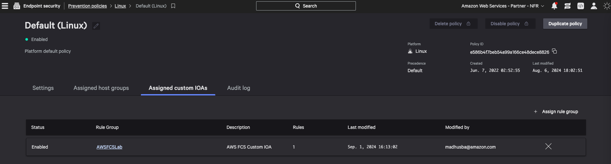

**Summary**

In this section we focused on the behavioral Indicators of Attack (IOAs). We saw how Falcon Horizon collects information about the events taking place in the cloud and reports those that could be associated with malicious activity. Like with misconfigurations, behavioral policies and findings are accompanied by actionable remediation steps.
