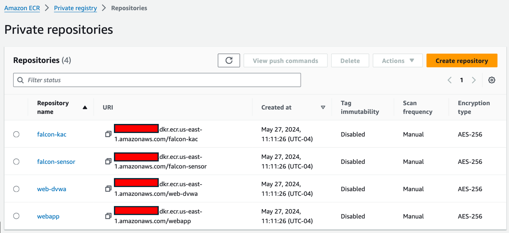
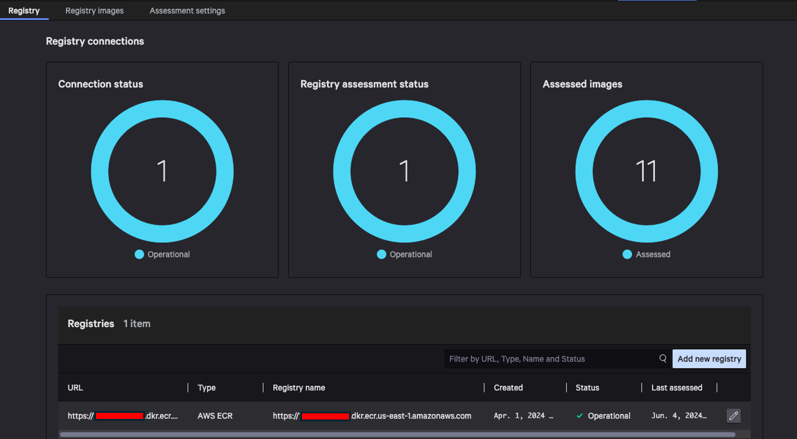
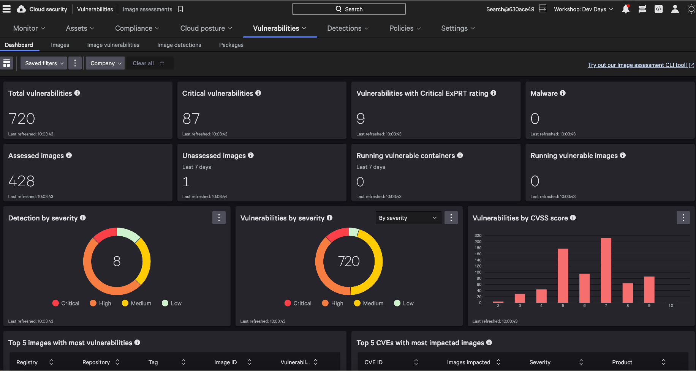
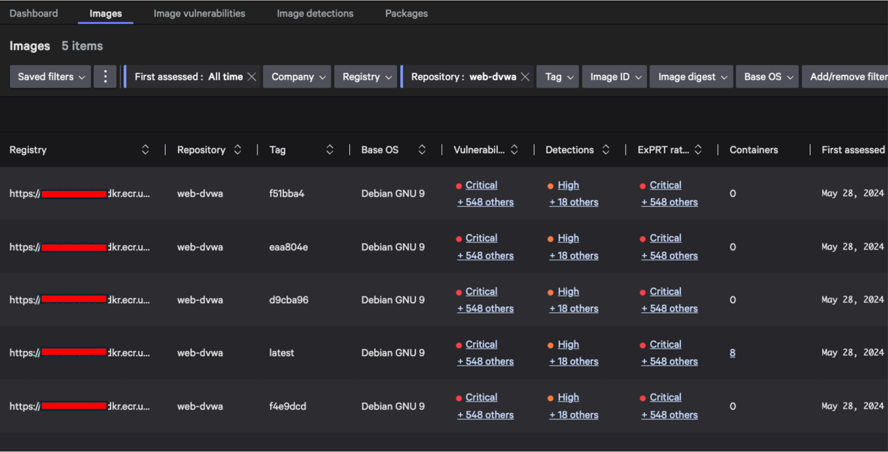
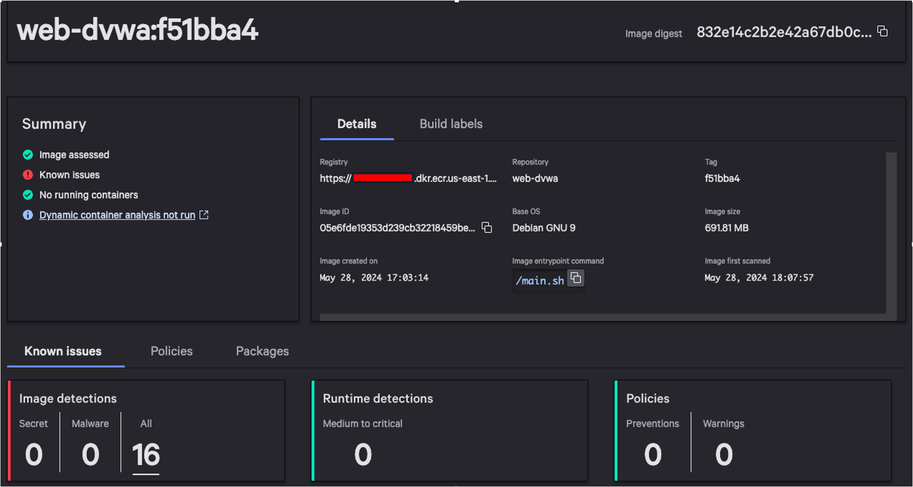
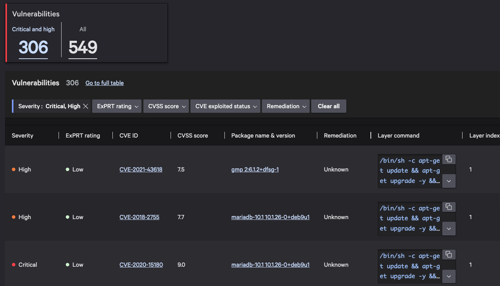
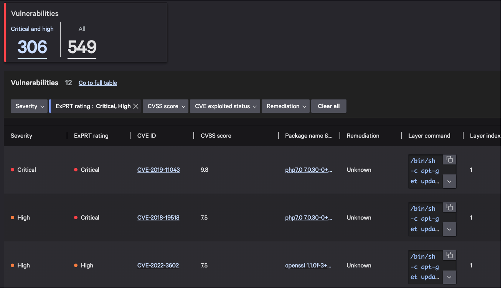

# Image Assessments

Let's start by reviewing how we store and assess container images.

In the AWS console, navigate to _Elastic Container Registry_. You'll see several repositories: some are
Falcon components used for protection (`falcon-kac` and `falcon-sensor`) and others represent our
workloads (`web-dvwa` and `webapp`).

In the Falcon console, navigate to _Cloud security_ > _Image assessment settings_ (under _Settings_).
The ECR registry for your AWS account is already registered for image assessments. This allows the
Falcon platform to scan images in your registry automatically.

Now, select _Vulnerabilities_ > _Image assessments_. This page shows an overview of all the container
images that the Falcon platform has scanned.

Under the pane titled _Assessed images_, click the large number to pivot to the list of all assessed
images. For each image, you can see the number of vulnerabilities and misconfiguration detections it
has. You'll notice `web-dvwa` has many vulnerabilities.

Click one of the `web-dvwa` rows, then click _See full image details_ in the pane. (If necessary, you can use the _Repository_ filter dropdown to show only these images.)

Many details are provided for the assessed image. Let's focus on vulnerabilities. Scroll down to the
_Vulnerabilities_ pane and click the number under _Critical and high_. This shows us the large number
of critical and high CVE's associated with the image.

That's a lot of vulnerabilities to triage! To help you prioritize all these vulnerabilities, CrowdStrike
provides its _ExPRT.AI_ rating that identifies the most important vulnerabilities based on your
environment and additional context about the vulnerability, such as whether a known exploit exists.
Click the X in the _Severity_ filter to clear NVD severity ratings, then use the _ExPRT rating_ filter
to select _Critical_ and _High_.

Using contextual ExPRT ratings has greatly decreased the number of vulnerabilities we need to triage.
Continue to the next section to put these image assessments to work with policies.
