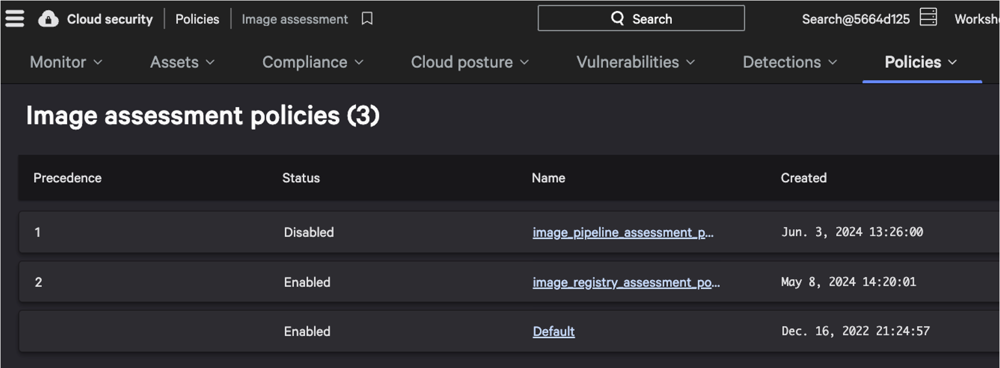
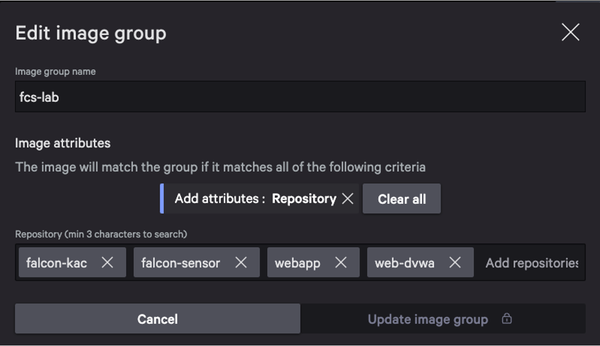
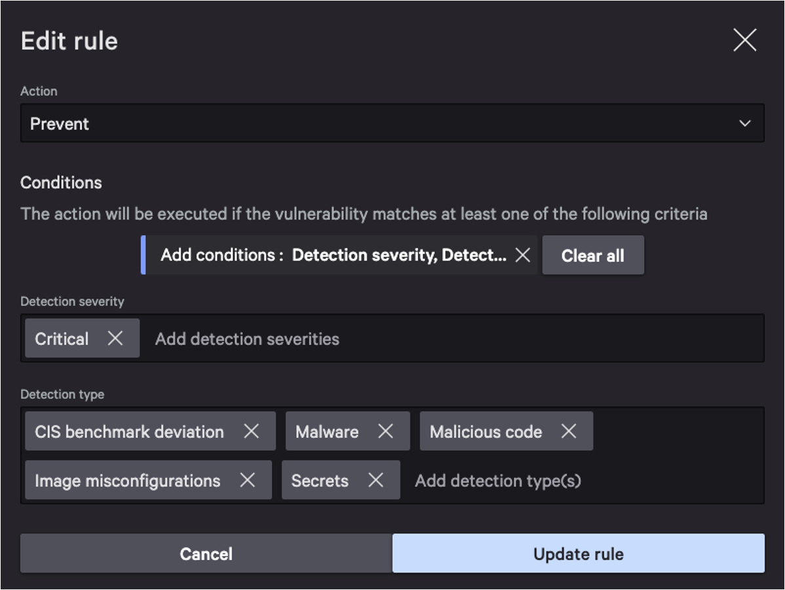
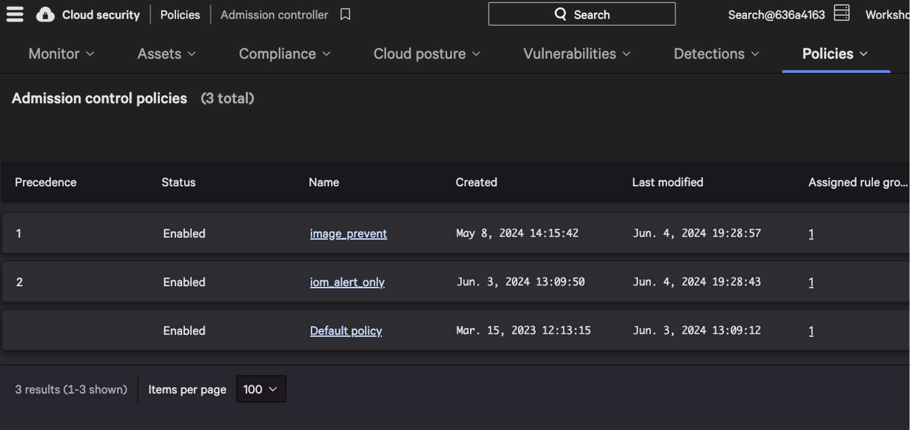
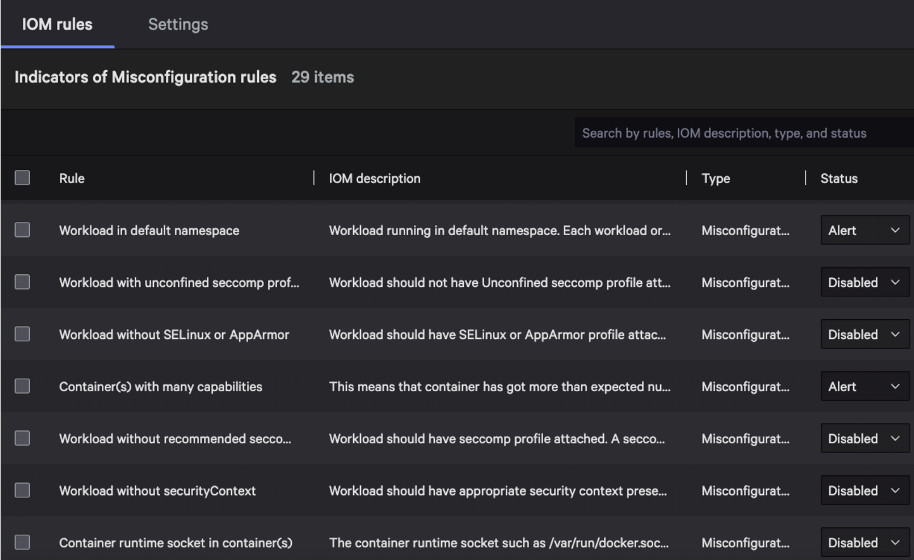
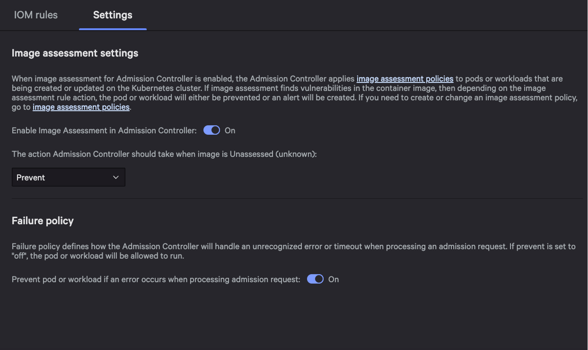

## Policy Configuration

In the last section, you saw how the Falcon platform connects to an ECR registry to assess images.
Now, we need to configure policies based on those assessments to keep our clusters safe.

Navigate to _Policies_ > _Image assessment_. You'll see a few policies created, as well as the `Default`
policy, which acts as a fallback if no other policy applies.

Select `image_registry_assessment_policy` to see the policy details. First, note that the policy applies
to the _image group_ where the repository is one of those that we saw at the beginning of the lab
in Amazon ECR.

Then under _Rules_, note that we are preventing detections that have a critical severity, and including
multiple types of detections.

Now that we've created an image assessment policy that prevents images with critical detections, we
need to associate that with a policy for our Kubernetes admission controller. Admission controllers
allow you to programmatically allow or deny workload deployments to Kubernetes clusters.
Navigate to _Policies_ > _Admission controller_.

The `iom_alert_only` policy will alert on (but not prevent) images based on indicators of
misconfiguration (IOM's) in that image. Select the `image_prevent` policy. In this policy, we have
disabled all but two IOM rules, since we want most IOM's to be handled by `iom_alert_only`.

Under _Settings_, we have enabled the use of image assessments in the admission controller. This means
that in addition to reviewing workloads for misconfigurations, the admission controller will also consider
the workload's image before allowing it to be deployed. We've also configured the admission controller
to prevent workloads with unassessed images from being deployed. This way, only known workloads will
be deployed to our cluster.

It's time to test these policies out. Continue to the next section.
