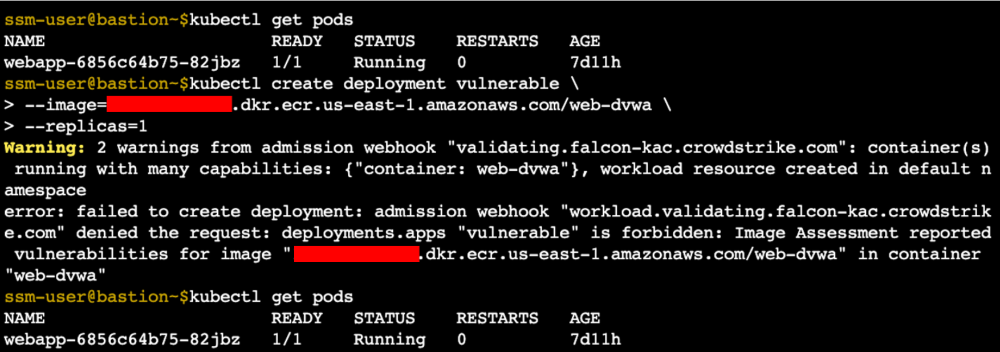
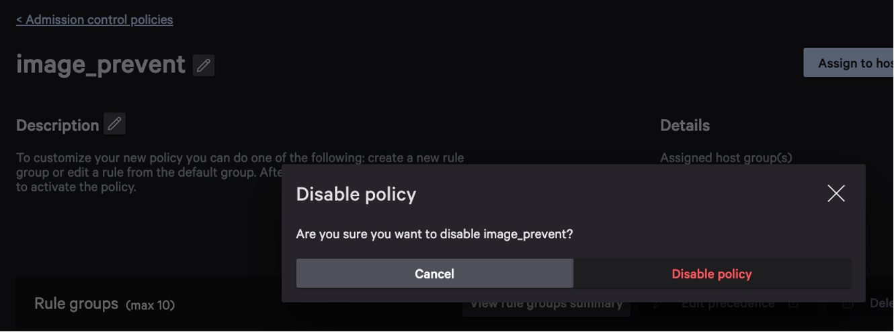
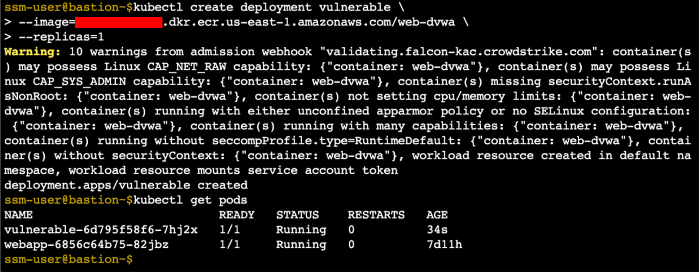

# Deploying Container Workloads

With image assessment and admission controller policies configured, we can test deployment of the
risky webapp to see how the policy behaves.

## Test the Policy

Connect to the bastion host (or use the connection you already have from the previous lab):

1. In the AWS console, navigate to _EC2_
1. Select the checkbox next to `LinuxBastion`
1. Click "Connect" on the top navigation bar, and then click the orange "Connect" button on the Session Manager tab.

To view the current state of the Kubernetes cluster, run `kubectl get pods`.
Only the main `webapp` workload (not `web-dvwa`) is running. Let's try to create a deployment with the
vulnerable `web-dvwa` image (you'll need to refer to ECR to copy the URI of this image and replace
the placeholder shown below).

```shell
kubectl create deployment vulnerable \
  --image=XXXX.dkr.ecr.us-east-1.amazonaws.com/web-dvwa \
  --replicas=1
```



The response from our admission controller shows two warnings (recall that the `images_prevent` policy
has two IOM rules set to alert) and one error that prevented the deployment
due to image assessment. Our policy worked! You can list pods again to confirm that no new deployments
were created.

## Modify the Policy

If necessary, we can disable the policy to allow this deployment. Navigate back to the `image_prevent`
admission controller policy in the Falcon console and click _Disable policy_, and confirm _Disable policy_
in the popup.



Now let's try to deploy the vulnerable workload again (this is the same command as above).

```shell
kubectl create deployment vulnerable \
  --image=XXXX.dkr.ecr.us-east-1.amazonaws.com/web-dvwa \
  --replicas=1
```



This time, we see warnings from the `iom_alert_only` policy, but no errors that prevented the deployment.
Again, list pods to confirm the deployment succeeded.

We have successfully used the admission controller to block a vulnerable image, then modify its
policies to allow that image. This simple demonstration shows just a fraction of what is possible
using Falcon's image assessment and admission controller policies.
