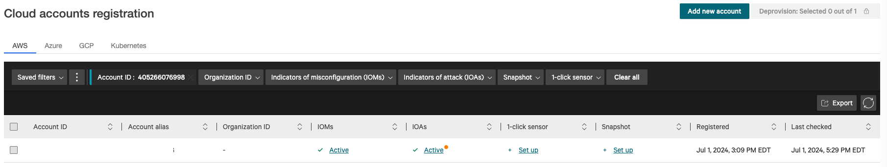

# Getting Started

If you are participating in an instructor-led event, you will be provided with a URL, event-code, or Falcon API credentials. Your instructor walk you through initial access to the Falcon and AWS consoles, and any additional build steps.

If you are already subscribed to Falcon Cloud Security and you’re preparing a training event for your internal team, you’ll need to create a Falcon API key to deploy the Falcon components. In that case, follow the directions in the “Self-Guided” section to create your API key in your existing CID. Note that Falcon-generated events and detections will appear in the console associated with that CID. Make sure your security team approves and is aware.

If you aren’t already a Falcon Cloud Security subscriber, you can sign up for a trial now:

1. Log in to your Falcon account
1. Click the hamburger icon at the top left
1. Click **CrowdStrike Store** then **CrowdStrike apps**
1. Click **Falcon Cloud Security**
1. Click **Try it free**

> [!TIP]
> If you're not a CrowdStrike customer, you can [create a free trial account](https://www.crowdstrike.com/products/trials/try-falcon-prevent/), then follow the steps above to activate the Falcon Cloud Security module in your trial account.

**AWS CodeBuild/CodePipeline:**

CodePipeline allows automation of a wide variety of build tasks, triggered by changes to a source code repository. In this environment, CodePipeline allows us to centralize multi-language builds within CloudFormation. In the deployInfra stack, CodeBuild launches eksctl tasks to build the cluster, nodegroup, OIDC federation, and IRSA (IAM Roles for Service Accounts) roles. We could just as easily use Terraform or other IaC languages in the CodeBuild environment. In the deployFalcon stack, we can simplify even potentially complex deployment workflows. Deployment of Falcon Cloud Security runtime protection (aka Cloud Workload Protection for Containers) entails multiple steps including modifying manifest files to include Falcon API key credentials and customer identifiers, deployment of an Operator, and a Helm chart which also includes adding Helm repositories with customized values. Doing all this manually is not terribly difficult but it breaks the automation, is susceptible to error, and is time-consuming toil. Creating CodeBuild jobs is also not very difficult and made more accessible by CrowdStrike offering these sample templates.

Login to Falcon console to confirm the AWS account is registered and CSPM is enabled for the account

URL: https://falcon.crowdstrike.com/cloud-security/registration-v2/aws

